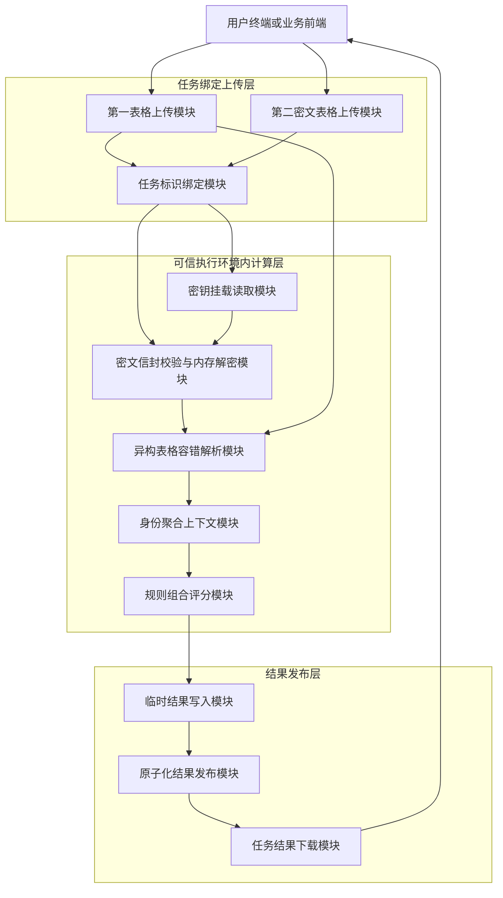
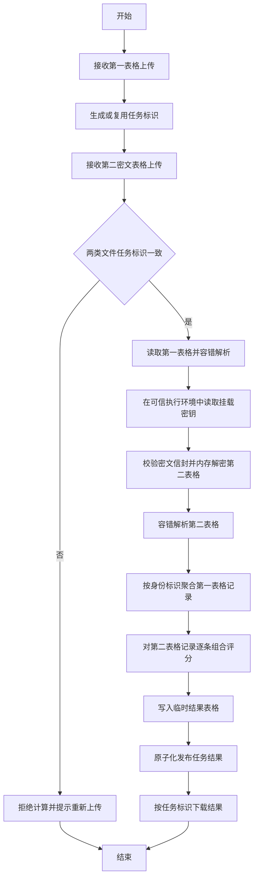

# 技术交底书

**案件名称**：一种跨机构表格数据安全融合的任务绑定式可信评分方法及系统

**技术联系人**：
- 姓名：待填写
- 电话：待填写
- 邮箱：待填写

**专利类型**：发明

---

## 注意事项

（1）交底书应使代理人能看懂，尤其是背景技术和详细技术方案，一定要写得全面、清楚、完整；
（2）技术的公开程度，应以本领域普通技术人员不需付出创造性劳动即可进行实施为准。
（3）在与代理人沟通时，对于代理人咨询的技术问题，应给予回答并认真讲解，并且按要求及时正确地补充相应技术材料。

## 一、介绍相关技术背景，描述与本发明技术最相近的现有技术，并说明该现有技术存在的缺点

### 1.1 现有技术

随着医疗、金融、政务等机构的信息化程度提升，不同机构掌握的业务数据具有互补价值。例如，一个机构保存用户在特定公共服务或医疗保障场景下的记录，另一机构保存用户账户、身份或联系方式等记录。若能在满足隐私保护要求的前提下对上述数据进行匹配和评分，可用于风险识别、资格核验、信用辅助评估或业务准入判断。

然而，上述数据通常包含姓名、证件号、手机号、账户标识、费用金额等敏感字段。传统做法包括直接上传明文文件、由数据使用方离线合并、通过固定模板导入后计算等。这类做法在跨机构场景中存在明显风险：一是数据提供方无法控制明文数据在对方环境中的存储与使用；二是多方 Excel 文件表头和页签格式不统一，固定模板解析容易失败；三是不同文件之间缺少稳定的任务绑定机制，容易发生错配；四是计算结果文件若直接写入，可能出现下载到半成品文件的问题。

本次查新优先尝试国家知识产权局公布公告检索工具。由于当前本地环境中 Playwright Chromium 下载长时间未完成，已降级使用 Google Patents 与公开网页检索，并记录如下相近技术。

（1）可信执行环境中的数据融合计算技术。

CN115085917A《可信执行环境的数据融合计算方法、装置、设备及介质》公开了在可信执行环境中进行数据融合计算的技术方案，重点是将融合计算放入可信运行环境中执行，以降低数据处理阶段的泄漏风险。公开源 URL：https://patents.google.com/patent/CN115085917A/zh

该类方案的局限在于，其关注可信环境内的通用融合计算能力，并未针对跨机构批量 Excel 文件给出任务标识绑定、密文表格信封校验、页签自动选择、字段容错映射、身份聚合评分和结果文件原子化输出的具体组合流程。

（2）零信任多方数据融合计算技术。

CN115580413A《一种零信任的多方数据融合计算方法和装置》公开了基于芯片层级可信执行环境的多方数据融合方案，通过改进后台开发准备阶段和计算阶段，使多方数据在零信任安全环境中融合计算，强调数据传输、存储和使用全过程的隐私保护。公开源 URL：https://patents.google.com/patent/CN115580413A/zh

该类方案能够说明 TEE 可用于多方数据融合，但其侧重通用零信任计算框架，未解决业务文件层面的同任务配对、密文 Excel 格式识别、异构表头标准化以及按身份聚合后的评分输出问题。

（3）基于可信执行环境的数据交易或数据流通技术。

CN114722424A《基于可信执行环境技术的数据交易平台的数据交易系统及方法》公开了基于可信执行环境的数据交易平台，用于医疗、交通、金融等敏感数据流通交易。公开源 URL：https://patents.google.com/patent/CN114722424A/zh

CN113538140A《一种基于可信执行环境与门限签名的数据交易方法》公开了通过可信执行环境、密钥分片、签名聚合等机制实现数据交易的方法。公开源 URL：https://patents.google.com/patent/CN113538140A/zh

CN115952484B《一种基于可信执行环境的数据流通方法、装置和系统》公开了基于可信执行环境的数据流通方案。公开源 URL：https://patents.google.com/patent/CN115952484B/zh

上述方案主要解决数据交易、授权访问、数据流通或密钥管理问题，并不关注具体跨机构表格文件在一次批处理任务中的安全解密、容错解析、聚合评分和结果生成闭环。

检索总结：现有技术已经公开了可信执行环境、零信任多方融合、数据交易、数据流通等上位能力，但未见公开与本发明相同的端到端技术组合，即：将来自不同机构的明文表格和密文表格通过任务标识配对，在可信执行环境内读取挂载密钥并仅以内存态解密密文表格，对多页签和异构表头执行容错解析，再按身份标识聚合并计算评分，最后以任务标识输出可下载结果文件。

### 1.2 现有技术存在的缺点

（1）现有通用 TEE 数据融合方案通常停留在安全计算环境或融合框架层面，缺少面向跨机构批量表格文件的具体任务绑定、文件配对和结果下载机制。

（2）现有数据交易或数据流通方案侧重交易、授权或密钥分片，不解决业务侧 Excel 文件页签不确定、表头不一致、金额字段异常等异构表格解析问题。

（3）传统明文上传或离线合并方式会使数据提供方的敏感字段暴露给数据使用方或普通服务器环境，难以保证银行侧或其他数据提供侧原始数据在传输、存储和计算过程中的安全边界。

（4）固定模板导入方式对表头名称、页签位置和字段格式依赖强，面对大小写、空格、下划线、短横线、金额逗号、非数值金额等情况容易解析失败或产生错误匹配。

（5）结果文件直接写入目标路径时，在并发或异常情况下可能出现半写入文件被下载，影响结果一致性和可追溯性。

## 二、针对上述缺点，说明本发明所要解决的技术问题

本发明所要解决的技术问题是：提供一种面向跨机构表格数据安全融合的任务绑定式可信评分方法及系统，使多个机构提供的表格数据能够在同一批处理任务中被安全配对、可信解密、容错解析、聚合计算并输出结果，同时降低敏感明文数据暴露和文件错配风险。

具体包括：

（1）解决跨机构文件上传后缺乏稳定配对的问题，使医保类明文表格与银行类密文表格等来自不同机构的数据能够通过同一任务标识绑定，避免错配计算。

（2）解决敏感数据提供方不愿交付明文文件的问题，使银行类或其他敏感表格以统一密文信封上传，并仅在可信执行环境中读取挂载密钥进行内存态解密。

（3）解决不同机构 Excel 文件格式不统一的问题，使系统能够自动选择含目标字段最多的页签，并通过表头归一化和字段映射完成容错解析。

（4）解决跨机构数据融合评分缺少可实施闭环的问题，使系统能够以身份标识聚合一侧记录，再对另一侧记录执行规则组合评分并生成结果。

（5）解决结果文件写入不完整的问题，使计算结果先写入临时文件，再原子化发布为可下载结果。

## 三、本发明技术方案的详细阐述

### 3.1 背景

本发明适用于至少两个数据参与方之间的批量表格数据融合计算场景。为便于说明，下文以第一数据方和第二数据方表示两类机构：第一数据方提供包含身份标识、姓名、手机号、金额等字段的明文表格；第二数据方提供包含用户标识、姓名、手机号、身份标识等字段的密文表格。上述“第一数据方”“第二数据方”仅为说明，不限定具体行业或机构类型。

本发明的核心思路是：由前端或调用方发起任务并上传两类文件，系统为同一任务保存明文表格和密文表格；计算时在可信执行环境中读取与数据提供方对应的密钥文件，对密文表格进行内存态解密；随后对两类表格执行容错解析，以身份标识建立聚合上下文；最后按预设规则计算每条第二数据方记录的评分，并生成仅包含必要字段的结果表格。

### 3.2 系统框图

### 3.3 模块功能说明

（1）任务标识绑定模块。

该模块用于为一次跨机构批处理任务生成或接收任务标识，并将第一表格文件和第二密文表格文件均保存到与该任务标识关联的位置。若其中一类文件已经上传，另一类文件上传时复用已有任务标识，从而保证后续计算只能针对同一任务标识下的文件进行。

（2）密文信封校验与内存解密模块。

该模块用于识别第二密文表格的信封格式。信封包括固定魔数、随机数长度、随机数和密文数据。计算时，模块在可信执行环境中读取挂载的密钥文件，校验密钥长度和密文信封结构，并以内存字节流形式解密得到表格内容，不将解密后的原始表格作为中间明文文件落盘。

（3）异构表格容错解析模块。

该模块用于处理不同来源 Excel 文件中的页签和表头差异。模块遍历工作簿中的页签，读取首行表头，对表头进行归一化处理，并统计与目标字段集合匹配的字段数量，选择匹配数量最高的页签作为数据页签。对选定页签，模块将归一化表头映射为统一内部字段，并对金额字段执行空值、逗号和非数值容错处理。

（4）身份聚合上下文模块。

该模块用于按身份标识聚合第一表格中的多行记录。对于同一身份标识，模块选取首个非空姓名、首个非空手机号，并累计可解析的金额字段，同时记录是否存在有效数值金额。该聚合结果作为第二表格评分的上下文。

（5）规则组合评分模块。

该模块用于对第二表格中的每条记录执行至少两个评分规则：身份标识对应的手机号一致性规则，以及身份标识对应的聚合金额阈值规则。各规则得分相加后形成总评分。若第一表格聚合结果中存在非空姓名，可用该姓名回填结果中的姓名字段，以减少不同数据方姓名字段不一致造成的输出偏差。

（6）原子化结果发布模块。

该模块用于将评分结果写入临时表格文件，完成写入和刷新后再将临时文件重命名为任务标识对应的结果文件；若重命名失败，可采用复制方式回退。下载接口只对结果目录下已发布的结果文件提供下载。

### 3.4 系统流程说明

流程说明如下：

S1：接收第一数据方上传的明文 Excel 文件。系统检查文件大小，并根据任务标识将其保存为第一类上传文件。保存后可立即解析该文件并返回有效数据行数，供用户确认。

S2：接收第二数据方上传的密文文件。该密文文件为加密后的 Excel 字节流，系统根据同一任务标识保存该密文文件。若前端或调用方已持有第一文件的任务标识，则第二文件上传时携带该任务标识。

S3：计算前校验两类文件是否属于同一任务标识。若任务标识不一致，系统拒绝计算，以避免跨批次错配。

S4：读取第一表格。系统对工作簿的多个页签执行字段匹配统计，选择匹配目标字段数量最高的页签，并将表头映射为统一字段。

S5：在可信执行环境中读取密钥。密钥以密钥文件形式挂载到运行环境，系统通过环境变量或等效配置确定数据提供方标识，再读取对应密钥文件。

S6：校验并解密第二密文表格。系统校验密文信封中的固定魔数、随机数长度和密钥长度，校验通过后执行 AES-GCM 解密，并将解密结果作为内存字节流传给表格解析模块。

S7：读取第二表格。系统采用与第一表格类似的页签选择、表头归一化和字段映射方式解析第二表格。

S8：构建第一表格聚合上下文。系统以身份标识为键，将第一表格中的多行记录归并为聚合记录。

S9：对第二表格逐条评分。系统根据第二表格记录的身份标识查找聚合上下文，分别计算手机号一致性得分和金额阈值得分，并将得分相加作为结果值。

S10：生成结果表格。结果表格至少包括第二数据方用户标识、姓名和评分结果。系统先写入临时文件，再将临时文件发布到结果目录，供后续按任务标识下载。

### 3.4.1 密文信封格式与解密处理

第二密文表格的信封格式可表示为：

`Envelope = Magic || NonceLen || Nonce || CipherText`

其中，`Magic` 为固定魔数，用于标识密文文件类型和版本；`NonceLen` 为随机数长度；`Nonce` 为加密时生成的随机数；`CipherText` 为使用对称密钥对原始 Excel 字节流进行认证加密后的密文。一个可实施例中，固定魔数为 `BC01`，随机数长度为 12 字节，对称加密算法为 AES-GCM，密钥长度为 16、24 或 32 字节。

解密处理包括以下校验步骤：

（1）判断信封总长度是否大于固定头部长度；
（2）判断信封前若干字节是否等于预设魔数；
（3）判断 `NonceLen` 是否等于系统支持的随机数长度；
（4）判断密钥长度是否为允许长度；
（5）校验通过后执行认证解密，若认证失败，则返回解密错误而不暴露内部明文或密钥信息。

上述信封格式可由不同语言的数据提供方工具生成，只要遵守相同的字节结构和加密参数，可信计算端即可一致解析。

### 3.4.2 多页签表格选择与字段容错映射

对于一个 Excel 工作簿，系统预设目标字段集合。例如，第一表格目标字段可包括身份标识、姓名、手机号、金额和期间字段；第二表格目标字段可包括用户标识、姓名、手机号和身份标识。

系统对每个页签的首行表头执行归一化处理。归一化处理包括去除首尾空白、转为统一大小写、删除空格、下划线和短横线等非字母数字字符。系统将归一化后的表头与字段映射规则比较，得到每列对应的内部字段。

对于每个页签，系统统计命中目标字段集合中不同字段的数量，并选择命中数量最高的页签作为数据页签。若没有页签命中字段，可回退到首个页签并继续尝试表头映射。

金额字段解析时，系统先去除千分位逗号，再尝试解析为浮点数；空值或非数值字段被标记为不可计入金额累计的状态，而不是使整个文件解析失败。

### 3.4.3 身份聚合与组合评分

系统以身份标识作为跨机构记录关联键。对于第一表格中相同身份标识的多行记录，系统构建聚合记录：

`Agg(d) = {Name(d), Phone(d), SumAmt(d), HasAmt(d)}`

其中，`d` 表示身份标识；`Name(d)` 为该身份标识下首个非空姓名；`Phone(d)` 为首个非空手机号；`SumAmt(d)` 为可解析金额的累计值；`HasAmt(d)` 表示是否存在至少一个可解析金额。

对第二表格中的记录 `b`，令其身份标识为 `d_b`，手机号为 `p_b`。手机号一致性得分 `S_phone(b)` 可表示为：

`S_phone(b) = 1`，当 `p_b` 非空、`Agg(d_b)` 存在、且 `p_b = Phone(d_b)`；

`S_phone(b) = 0`，否则。

金额阈值得分 `S_amt(b)` 可按如下方式计算：

当 `Agg(d_b)` 不存在或 `HasAmt(d_b)` 为假时，`S_amt(b)=0`；

当 `A=SumAmt(d_b)` 存在时，按阈值区间给分：

- `A <= T1` 时，`S_amt(b)=W0`；
- `T1 < A <= T2` 时，`S_amt(b)=W1`；
- `T2 < A <= T3` 时，`S_amt(b)=W2`；
- `A > T3` 时，`S_amt(b)=W3`。

其中，`T1<T2<T3`，`W0<W1<W2<W3`。一个可实施例中，`T1=5000`、`T2=10000`、`T3=20000`，`W0=0`、`W1=3`、`W2=5`、`W3=7`。

总评分可表示为：

`S_total(b)=S_phone(b)+S_amt(b)`

若 `Agg(d_b)` 中存在非空姓名，则结果中的姓名字段可采用该姓名；否则采用第二表格中的姓名。

### 3.5 关键技术参数

（1）任务标识：用于绑定同一次跨机构批处理任务中的多类文件。任务标识可以由系统生成，也可以由调用方在上传时提交。

（2）密文信封魔数：用于区分系统可识别的密文格式。一个可实施例中为 `BC01`。

（3）随机数长度：用于 AES-GCM 等认证加密算法。一个可实施例中为 12 字节。

（4）对称密钥长度：可为 16、24 或 32 字节，分别对应不同强度的对称加密密钥。

（5）页签选择匹配数：每个页签首行表头命中目标字段集合的不同字段数量。系统选择匹配数最大的页签。

（6）表头归一化规则：包括去除空白、统一大小写、删除空格、下划线、短横线等字符。该规则可扩展为同义字段字典。

（7）金额阈值：包括 `T1`、`T2`、`T3` 三个递增阈值。一个可实施例中分别为 5000、10000、20000。

（8）评分权重：包括手机号一致性权重和金额区间权重。一个可实施例中手机号一致性得分为 1，金额区间得分为 0、3、5、7。

（9）结果发布路径：包括临时结果路径和正式结果路径。临时结果完成写入后再发布为正式结果，正式结果按任务标识命名。

## 四、与现有技术相比，本发明具有哪些优点？

（1）降低跨机构敏感数据暴露风险。本发明使第二数据方能够上传密文表格，并使解密过程发生在可信执行环境中，解密后的原始表格以内存态参与解析和计算，减少明文落盘和非可信环境暴露。

（2）减少跨批次文件错配。本发明将不同数据方上传的文件与同一任务标识绑定，计算前校验任务一致性，避免将不同批次或不同用户上传的文件错误合并。

（3）提高异构 Excel 文件适配能力。本发明通过多页签字段匹配、表头归一化、字段映射和金额容错解析，使系统能够适应表头命名和页签布局差异，降低对固定模板的依赖。

（4）形成可解释的跨机构评分结果。本发明以身份标识为关联键，采用手机号一致性和金额阈值等规则组合评分，评分来源清晰，便于业务复核和参数调整。

（5）提高结果文件一致性。本发明先将结果写入临时文件，再原子化发布为正式结果文件，降低下载到半写入文件的概率。

（6）便于跨语言部署和本地自测。密文信封格式与加密参数明确，不同语言工具可生成兼容密文文件，可信计算端统一解析，有利于数据提供方独立加密和交付。

## 五、本发明的技术关键点和欲保护点是什么？

（1）任务绑定式跨机构文件配对机制。保护点在于：为来自不同机构的明文表格和密文表格建立同一任务标识，只有同一任务标识下的文件才进入计算流程。

（2）密文表格在可信执行环境内的信封校验和内存态解密机制。保护点在于：密文文件采用包括魔数、随机数长度、随机数和认证密文的信封格式，计算时在可信执行环境中读取挂载密钥并完成校验解密，解密结果直接进入内存解析流程。

（3）面向多来源 Excel 的页签选择和字段容错映射机制。保护点在于：遍历多页签，根据目标字段命中数量选择数据页签，并通过表头归一化和同义映射生成统一字段。

（4）基于身份标识的第一表格聚合上下文构建机制。保护点在于：对同一身份标识下的多行记录提取首个非空姓名、首个非空手机号，并累计有效金额，形成后续评分上下文。

（5）跨机构记录的组合评分机制。保护点在于：对第二表格记录按身份标识查找聚合上下文，结合手机号一致性规则和金额阈值规则计算总评分，并输出必要结果字段。

（6）结果文件原子化发布机制。保护点在于：评分结果先写入临时文件，完成写入后再发布为任务结果文件，下载接口基于任务标识读取正式结果文件。

（7）上述机制构成的系统、装置、电子设备和计算机可读存储介质。保护点不仅包括方法步骤，也包括执行上述步骤的模块化系统以及部署于可信执行环境的计算节点。

## 六、其它

### 6.1 实施例

某业务场景中，第一数据方提供明文 Excel 文件，包含人员编号、姓名、手机号、身份标识、金额和期间字段。第二数据方提供密文文件，该密文文件是对第二数据方 Excel 原始字节流使用 AES-GCM 加密后形成的信封文件。

步骤如下：

（1）用户在业务前端上传第一数据方 Excel，系统生成任务标识 `job-001`，保存该文件并解析行数。

（2）用户上传第二数据方密文文件，并携带任务标识 `job-001`。系统将密文文件保存为该任务标识对应的第二类上传文件。

（3）用户发起计算。系统确认第一文件和第二文件均存在且任务标识一致。

（4）系统读取第一 Excel，选择含目标字段最多的页签，并解析得到第一数据记录。

（5）系统在可信执行环境中读取密钥文件，对第二密文文件执行信封校验和 AES-GCM 解密，得到第二 Excel 字节流，并直接从内存读取。

（6）系统解析第二 Excel，得到第二数据记录。

（7）系统按身份标识聚合第一数据记录。例如，身份标识 `D1` 对应两条第一数据记录，金额分别为 2000 和 4000，则累计金额为 6000。

（8）系统对第二数据记录评分。若第二记录的身份标识为 `D1`，手机号与第一聚合记录一致，则手机号得分为 1；累计金额 6000 落入 `5000 < A <= 10000` 区间，金额得分为 3；总评分为 4。

（9）系统生成结果 Excel，其中包括第二数据方用户标识、姓名和总评分。姓名优先使用第一聚合记录中的非空姓名。

（10）系统先写临时结果文件，再发布为 `job-001` 对应的正式结果文件，用户按任务标识下载。

### 6.2 可替换实施方式

（1）第一数据方和第二数据方的行业类型不受限制，可替换为其他存在跨机构敏感数据融合需求的场景。

（2）身份标识可以是证件号、经过脱敏或哈希处理的唯一标识、账号映射标识等，只要能在两类表格间建立关联。

（3）认证加密算法不限于 AES-GCM，也可替换为具有完整性校验能力的其他认证加密算法。

（4）密钥挂载方式不限于文件挂载，也可以由可信密钥服务在远程认证通过后发放。

（5）评分规则不限于手机号一致性和金额阈值，可扩展为地址一致性、期间覆盖率、记录频次、异常缺失率等规则；各规则可按权重求和、分段函数或规则引擎方式组合。

（6）结果输出不限于 Excel，可输出 CSV、JSON 或数据库记录，但优选保留任务标识和原子化发布机制。

### 6.3 技术效果

通过上述方案，系统能够在不要求第二数据方交付明文表格的情况下完成跨机构评分计算；能够适配多页签和表头差异，减少人工改表；能够通过任务标识确保上传文件配对；能够通过可信执行环境和认证加密信封降低敏感数据泄漏风险；能够通过原子化结果发布提高下载结果的一致性。
