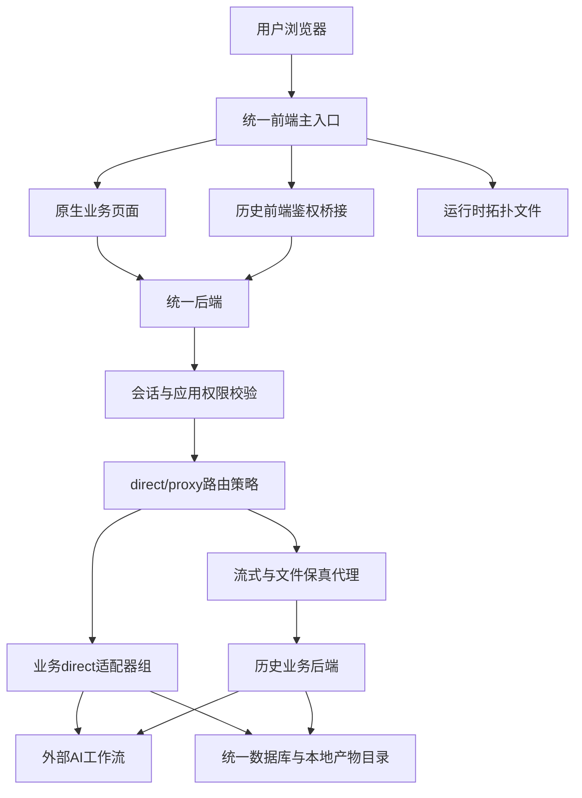
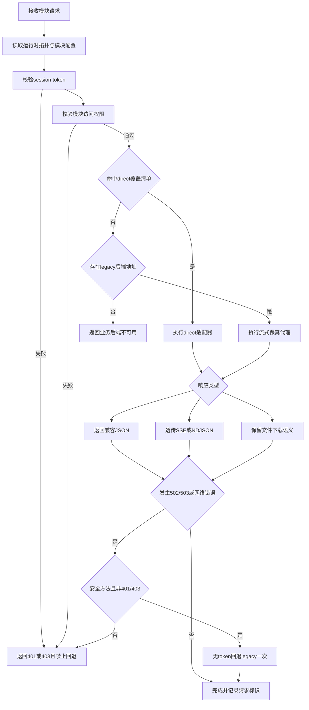

# 技术交底书

**案件名称**：一种多业务智能应用渐进式统一接入与受控回退的方法及系统

**技术联系人**：
- 姓名：待填写
- 电话：待填写
- 邮箱：待填写

**专利类型**：发明

---

## 注意事项

（1）交底书应使代理人能看懂，尤其是背景技术和详细技术方案，一定要写得全面、清楚、完整；
（2）技术的公开程度，应以本领域普通技术人员不需付出创造性劳动即可进行实施为准。
（3）在与代理人沟通时，对于代理人咨询的技术问题，应给予回答并认真讲解，并且按要求及时正确地补充相应技术材料。

## 一、介绍相关技术背景，描述与本发明技术最相近的现有技术，并说明该现有技术存在的缺点

### 1.1 现有技术

随着企业内部 AI 应用数量增加，常见系统会同时包含智能问答、文档审查、报告生成、行业分析等多个业务模块。各模块通常来自不同历史系统，分别具有独立前端、独立后端、不同的流式协议、不同的文件缓存目录和不同的外部模型工作流。若一次性重写或一次性合并，容易造成原有业务中断；若长期保持多套系统独立运行，则会出现登录态割裂、权限绕过、配置分散、端口冲突、回滚不可控和维护成本高等问题。

本次查新以国家知识产权局中国专利公布公告站为优先渠道，使用的检索语义块包括“业务代理”“iframe鉴权”“运行时端口”“流式代理”“渐进迁移”“应用权限”“统一网关”“系统迁移”。其中“iframe鉴权”“流式代理”未检出与本案高度接近的公布公告结果；其余检索词命中若干相关但侧重点不同的公开方案。检索结果如下。

**（1）异构系统迁移及双轨运行类技术。**  
CN121764612A，名称为“一种异构系统迁移及双轨运行方法”。该方案以对象及对象间关系为迁移核心，将数据导出为 JSON 文件，按业务域进行渐进迁移，并在新系统记录旧系统对象和关系标识，以保证新旧系统双轨运行期间的数据同一性和更新冲突处理。该方案主要解决异构系统数据迁移、对象关系识别和新旧系统更新策略问题。  
来源链接：国家知识产权局公布公告站 `http://epub.cnipa.gov.cn/patent/CN121764612A`；Google Patents `https://patents.google.com/patent/CN121764612A/en`。  
局限性：其重点在数据对象迁移和双轨数据一致性，不涉及多个 AI 业务模块在同一平台下的 direct/proxy 共存路由、运行时拓扑生成、按应用权限拦截、流式响应透传、文件下载语义保留和受控回退策略。

**（2）微服务与微前端融合的统一平台类技术。**  
CN121832906A，名称为“基于微服务与微前端融合的低代码开发平台及集成方法”。该方案包括微服务架构、统一网关、注册中心、配置中心、低代码平台模块以及微前端应用中心，并通过适配接口组实现数据同步和权限认证。该方案主要面向低代码生成的前端微应用和后端微服务的运行时集成。  
来源链接：国家知识产权局公布公告站 `http://epub.cnipa.gov.cn/patent/CN121832906A`；Google Patents `https://patents.google.com/patent/CN121832906A/en`。  
局限性：其重点在低代码生成、微服务注册和微前端集成，不针对已有异构 AI 业务系统的渐进式迁入；也未公开对 SSE、NDJSON、DOCX/PDF/Excel/图片下载、multipart 上传等不同业务协议进行统一鉴权后的透明保真处理，以及未公开在 direct 接管和 legacy 回滚之间进行按错误类型、请求幂等性和权限状态约束的切换控制。

**（3）统一网关调度与容灾类技术。**  
CN121923982A，名称为“基于网关调度的容灾方法、装置、设备及存储介质”。该方案采集目标业务服务的网络层、数据层和应用层运行状态数据，对多模态运行状态进行关联分析后生成容灾决策指令，并通过统一网关将业务流量调度至目标数据中心，同时执行原子任务编排流程。  
来源链接：国家知识产权局公布公告站 `http://epub.cnipa.gov.cn/patent/CN121923982A`；Google Patents `https://patents.google.com/patent/CN121923982A/en`。  
局限性：其技术目标是容灾切换和数据中心级流量调度，不解决历史业务模块逐步接入统一主应用时的模块级 direct/proxy 选择、会话权限校验、legacy 兼容响应、不转发敏感凭据以及安全回退边界问题。

**（4）应用服务链式调度类技术。**  
CN121547399A，名称为“应用服务的链式调度系统和方法”。该方案由服务感知网关解析应用流量报文中的服务链标识和服务标识，查询服务路由并将流量引导至 SR Policy，以实现应用业务层、业务代理层和网络转发层之间的链式访问调度。  
来源链接：国家知识产权局公布公告站 `http://epub.cnipa.gov.cn/patent/CN121547399A`；Google Patents `https://patents.google.com/patent/CN121547399A/en`。  
局限性：其重点在网络路径和服务链转发，不涉及统一业务平台内部的应用权限、iframe 鉴权上下文、direct 业务适配器、legacy 代理兜底、流式响应和文件响应的兼容保真。

**（5）应用权限控制类技术。**  
CN122046340A，名称为“权限控制方法、装置、电子设备及计算机可读存储介质”。该方案根据待处理应用的场景类型信息确定权限基准集合，对已授权权限集合进行扫描并执行权限回收，以避免一次授权长期有效。  
来源链接：国家知识产权局公布公告站 `http://epub.cnipa.gov.cn/patent/CN122046340A`。  
局限性：其重点是终端或应用权限的合理回收，不涉及统一平台在请求进入业务模块前进行会话校验、模块权限校验、路由选择、fallback 禁止条件和敏感凭据隔离的组合机制。

综上，现有技术分别公开了异构系统数据迁移、微服务微前端集成、统一网关容灾、服务链调度和权限控制等方案，但未见将“运行时拓扑生成、父子应用鉴权桥接、统一后端 direct/proxy 路由、legacy-compatible 协议保真、按错误类型和请求幂等性约束的受控回退”组合为一套用于多业务智能应用渐进式统一接入的闭环方案。

### 1.2 现有技术存在的缺点

（1）现有迁移方案多以数据迁移或服务注册为核心，缺少对历史业务 API、流式协议和文件产物的逐步接管机制。一旦直接重写业务逻辑，容易导致用户侧接口、前端状态和导出行为不兼容。

（2）现有统一网关方案偏重网络层或数据中心级流量调度，缺少模块级应用权限和业务协议保真约束。若简单反向代理，可能把平台会话凭据转发给历史后端，增加凭据泄露和权限绕过风险。

（3）现有微前端或 iframe 集成通常解决页面嵌入问题，但没有给出在父页面、子应用、统一后端之间安全传递临时鉴权上下文的完整校验条件，尤其缺少 source、origin、appCode、用户登录态和模块权限的联合校验。

（4）现有系统迁移方案往往只提供“新系统/旧系统”二选一切换，缺少按照 direct 覆盖范围、运行时后端地址、请求方法幂等性和错误类型进行细粒度回退的策略。

（5）对于智能问答、竞对分析、合同审查、标书生成等 AI 业务，系统通常同时存在 SSE、NDJSON、multipart 上传、DOCX/PDF/Excel/图片下载、后台任务状态和外部工作流调用。现有方案缺少对此类异构协议进行统一鉴权后透明透传或直接适配的通用方法。

## 二、针对上述缺点，说明本发明所要解决的技术问题

本发明旨在解决多业务智能应用从多个历史系统渐进式迁入统一平台时的以下技术问题：

（1）如何在不一次性重写全部历史业务逻辑的情况下，使不同业务模块可以逐步从 legacy 后端代理模式过渡到统一后端 direct 模式，并保持前端请求路径和响应结构兼容。

（2）如何为嵌入式历史前端或统一前端模块提供安全的鉴权上下文，使平台会话 token 不进入 URL、不长期落地到子应用存储，且子应用不能越权获取其他模块的 API base。

（3）如何根据运行时拓扑、模块配置、direct 覆盖清单和 legacy 后端可用性，自动决定请求由统一后端直接处理还是通过受控代理转发，并在异常时执行可审计、不可绕权的回退。

（4）如何在统一后端接管不同 AI 业务模块时，保留原有 SSE、NDJSON、文件上传、文件下载、任务状态和外部模型工作流语义，使用户侧前端无需整体重写。

（5）如何在开发、测试和部署场景下动态分配端口、生成运行时拓扑文件，并使前端和后端基于同一拓扑描述完成模块发现、健康检查和回滚入口管理。

## 三、本发明技术方案的详细阐述

### 3.1 背景

本发明适用于包含多个智能业务模块的统一平台。为便于脱敏，下文将业务模块抽象为模块 A、模块 B、模块 C 和模块 D。其中，模块 A 可以是结构化分析与报告生成类模块，模块 B 可以是知识问答类模块，模块 C 可以是文档审查与批注导出类模块，模块 D 可以是文档生成与任务编排类模块。不同模块可分别具有历史前端、历史后端、独立配置、独立本地文件目录和不同外部 AI 工作流。

本发明的核心思想是：以统一前端和统一后端为主路径，以运行时拓扑为模块发现依据，以会话和应用权限为访问门槛，以 direct 适配器逐步接管低风险或已迁移接口，以 legacy 代理兜底未知路径或回滚路径，并对 fallback 条件进行严格约束，从而形成“可迁移、可回退、可鉴权、可保真”的多业务智能应用统一接入方案。

### 3.2 系统框图

系统包括如下组成部分：

（1）统一前端主入口：负责登录、会话恢复、工作台、模块导航和原生业务页面承载。在历史前端仍需保留时，统一前端还可作为 iframe 父页面。

（2）历史前端鉴权桥接模块：用于在父页面与历史子应用之间传递一次性鉴权上下文。该上下文包括请求标识、模块编码、平台会话 token、客户端标识和统一后端下的模块 API base。

（3）运行时拓扑模块：根据应用配置、启动模式、端口占用情况和 legacy 回滚参数生成运行时拓扑文件，拓扑中包含统一前端 URL、统一后端 URL、模块前端 URL、legacy 后端 URL、健康检查 URL 等。

（4）统一后端：作为所有业务模块 API 的统一入口，首先执行平台会话校验和应用权限校验，再根据路由策略将请求分派给 direct 适配器或受控 legacy 代理。

（5）direct 适配器组：逐步接管已经迁移的业务 API，保留历史接口路径、状态码和响应结构。例如模块 A 输出 NDJSON 事件流，模块 B 输出 SSE 事件流，模块 C 输出 DOCX 文件响应，模块 D 输出任务进度 SSE 和多格式导出文件。

（6）流式与文件保真代理：当请求尚未迁移或需要回滚时，代理模块以流式方式转发请求体和响应体，保留 Content-Type、Content-Disposition 等必要响应头，同时过滤 Authorization、Cookie、Set-Cookie 等敏感头。

（7）数据与产物存储：包含统一数据库、业务 schema、本地文件产物目录和外部 AI 工作流配置。系统不要求所有文件立即迁移至对象存储，可通过命名空间、run_id、project_id 等标识实现阶段性边界控制。

### 3.3 模块功能说明

**（1）运行时拓扑生成模块。**  
该模块读取静态应用配置，解析每个模块的编码、路由路径、目标 API 前缀、是否启用历史前端、默认启动策略、端口优先值和端口范围。对于每个待启动服务，若优先端口可用则选择优先端口；若不可用则在配置范围内选择最小可用端口，并把已选择端口加入保留集合，避免同一轮规划中重复占用。其结果写入运行时拓扑文件，供统一前端和统一后端读取。

**（2）父子应用鉴权桥接模块。**  
当历史子应用加载后，其向父页面发送鉴权请求。父页面仅在以下条件全部满足时返回鉴权上下文：消息来源等于当前 iframe window；消息 origin 等于当前 iframe URL origin；请求中的 appCode 与当前嵌入模块编码一致；当前用户已登录；当前用户拥有该模块访问权限。若任一条件不满足，返回鉴权错误消息。鉴权上下文只通过 postMessage 传递，不写入 URL query/hash，不写入控制台日志，不写入子应用长期本地存储。

**（3）统一鉴权与权限守卫模块。**  
统一后端接收请求后，从 Authorization 请求头提取平台 session token，查询当前用户，并执行应用权限校验。管理员可默认允许访问，普通用户按用户-应用权限表判断。无 token、token 无效或无模块权限时，统一后端直接返回 401 或 403，且不得访问 legacy 后端、外部 AI 工作流或本地文件系统。

**（4）direct/proxy 路由策略模块。**  
系统为每个模块维护 direct 覆盖清单。当请求路径命中 direct 覆盖清单时，由统一后端适配器直接处理；当请求路径未命中且运行时拓扑中存在可用 legacy 后端地址时，进入受控代理；当未命中 direct 且无 legacy 后端地址时，返回业务后端不可用错误，而不是抛出内部异常。

**（5）legacy-compatible direct 适配器模块。**  
direct 适配器在统一后端内复用或包装原业务纯逻辑，保留历史接口路径、请求字段、响应字段、状态码和流式协议。例如，知识问答模块保持 text/event-stream 的 session、delta、done、error 事件；结构化分析模块保持 application/x-ndjson 的逐行事件；文档审查模块保持 run_id、queued/running/completed/failed 状态和 DOCX 下载语义；文档生成模块保持 task_id、progress SSE、cancel 和 DOCX/PDF/Excel/图片导出语义。

**（6）流式与文件保真代理模块。**  
代理模块在鉴权后读取 legacy 后端 URL，构造目标 URL 并以流式请求体转发，避免完整缓冲大文件上传或长流响应。代理时不转发 Authorization、Cookie 和 Host 等敏感头；可转发 X-Request-ID、用户标识、用户角色和客户端标识等非敏感上下文。响应侧过滤 Set-Cookie、CORS 和 hop-by-hop 头，但保留 Content-Type、Content-Disposition 等与下载和流式读取相关的头。

**（7）受控回退模块。**  
系统限定 fallback 只在 bridge 不可用、统一后端返回 502/503 或网络错误等可回滚场景发生；401 和 403 不允许 fallback；非幂等 POST/PUT/PATCH/DELETE 默认不允许自动重放到 legacy 后端；流式响应开始后不允许中途重发。fallback 请求不得携带平台 token 或长期凭据，从而避免通过 legacy 回退绕过平台权限。

**（8）任务与文件边界模块。**  
对于文档审查、文档生成等依赖本地文件产物的业务，系统在迁移阶段保留原有上传目录、运行目录、缓存目录和知识库同步状态目录，同时通过 run_id、project_id、task_id、filename 等标识做字符白名单和根目录约束。未来若接入对象存储或统一任务队列，可通过适配器包装现有任务而非一次性重写业务。

### 3.4 系统流程说明

流程可分为以下步骤。

**步骤 S1：启动规划与运行时拓扑生成。**  
系统读取应用配置，确定统一前端、统一后端和各业务模块的启动模式。对于每个服务，执行端口选择函数：

`p = preferred_port`，当 `preferred_port` 位于 `port_range` 且未被占用；否则 `p = min({q | q 位于 port_range，q 未被占用且 q 未被本轮规划保留})`。

生成的拓扑写入运行时文件。默认模式仅写入统一前端和统一后端；回滚模式可写入历史前端 iframe URL 和 legacy 后端 URL。

**步骤 S2：前端模块发现与鉴权上下文准备。**  
统一前端读取运行时拓扑和模块配置，展示用户可访问的模块入口。对于原生页面，前端直接使用统一 API base；对于历史 iframe 页面，子应用向父页面发起鉴权请求，父页面按 source、origin、appCode、登录态和模块权限联合校验后返回临时鉴权上下文。

**步骤 S3：统一后端入口鉴权。**  
统一后端的每个业务模块入口均先执行 session token 提取、用户查询和模块权限判断。该步骤位于 direct 适配器和 proxy 之前，保证未登录或无权限用户不能触发业务逻辑、外部 AI 调用、legacy 后端访问或文件系统读取。

**步骤 S4：路由决策。**  
设模块为 `m`，请求路径为 `r`，direct 覆盖集合为 `D_m`，legacy 后端地址为 `B_m`，权限判断结果为 `A(u,m)`。路由函数可表示为：

`route(u,m,r) = direct`，当 `A(u,m)=true` 且 `r 属于 D_m`；  
`route(u,m,r) = proxy`，当 `A(u,m)=true`、`r 不属于 D_m` 且 `B_m` 非空；  
`route(u,m,r) = unavailable`，当 `A(u,m)=true`、`r 不属于 D_m` 且 `B_m` 为空；  
`route(u,m,r) = denied`，当 `A(u,m)=false`。

**步骤 S5：direct 适配执行。**  
当路由结果为 direct 时，统一后端调用对应模块适配器。适配器可以直接实现业务逻辑，也可以在同一进程内加载历史纯业务模块，但对外保持历史接口兼容。例如模块 B 在流式问答完成后写入问答 turn；模块 C 在创建审查 run 后调用原 pipeline 并写入 run 目录；模块 D 复用原任务管理器和文档组装逻辑。

**步骤 S6：proxy 保真转发。**  
当路由结果为 proxy 时，统一后端构造目标地址，将请求流式转发至 legacy 后端。请求头中过滤 Authorization、Cookie 和 Host；响应头中过滤 Set-Cookie 和 CORS 头，保留下载与流式相关头。该步骤使未迁移路径仍可运行，同时由统一后端提供统一鉴权边界。

**步骤 S7：响应类型保真。**  
系统按响应类型分别处理：普通 JSON 保持历史字段结构；SSE 保持 `text/event-stream`；NDJSON 保持逐行事件；文件响应保留文件名和 Content-Disposition；图片或 PDF 预览可由前端通过 authenticated fetch 获取 blob 后转换为内存 URL。

**步骤 S8：受控回退判断。**  
当前端或统一后端检测到可回滚错误时，执行如下回退判断：

`fallback_allowed = (error in {502,503,network_error}) AND (method in {GET,HEAD,OPTIONS}) AND (status not in {401,403}) AND (stream_started=false)`。

仅当 `fallback_allowed=true` 时才允许对 legacy 后端重试一次；回退请求不携带平台 token 和客户端会话凭据。对于非幂等请求，除非用户显式进入回滚模式，否则不得自动重放。

### 3.4.1 direct/proxy 共存的迁移策略

本发明并非简单地把历史后端挂在统一网关后，而是把每个模块的接口拆分为 direct 覆盖路径和 proxy 兜底路径。迁移早期，可先将健康检查、历史记录查询、会话创建等低风险接口 direct；随后接管流式分析、知识库文档、审查 run、文件下载、任务状态等复杂接口；最后保留 catch-all proxy 作为未知路径和回滚兜底。当某一模块常规业务 API 全部 direct 后，legacy 后端进程可退出默认启动集合，但 legacy 源码和回滚入口仍可保留。

该策略的技术效果是：在用户侧路径稳定的前提下，使统一后端能够逐步扩大 direct 覆盖范围；同时由于 catch-all proxy 被置于统一鉴权之后，即使存在未知路径，也不会绕过平台权限。

### 3.4.2 多协议保真处理策略

针对 AI 业务的异构协议，本发明采用以下处理：

（1）对于 SSE，将统一后端设置为 StreamingResponse 或等效流式响应，不等待完整回答生成后再返回；完成后再写入会话 turn 或任务结果。

（2）对于 NDJSON，将业务执行线程产生的事件写入有界队列，再由异步响应逐行输出，客户端断开时设置关闭标记，避免后台继续写入已关闭流。

（3）对于 multipart 上传，代理层不手动改写 multipart Content-Type，由浏览器或调用方生成 boundary，统一后端以流式请求体转发，避免大文件重组。

（4）对于 DOCX、PDF、Excel、图片等文件，统一后端或代理层保留文件响应的 Content-Type 和 Content-Disposition，前端在鉴权下载时使用 blob 或 object URL，避免把 token 放入文件 URL。

### 3.4.3 安全隔离策略

本发明的安全隔离由三层组成。第一层是父子应用鉴权桥接，保证只有当前 iframe、当前 origin、当前 appCode 且当前用户有权限时才获得上下文。第二层是统一后端权限守卫，保证所有 direct 和 proxy 请求均先通过 session 与模块权限校验。第三层是回退隔离，保证 401、403、非幂等请求和已开始流式响应不自动回退，且回退请求不携带平台 token、Cookie 或 Set-Cookie。

### 3.5 关键技术参数

（1）`appCode`：业务模块唯一编码，用于权限校验、API base 映射和运行时拓扑索引。示例值可为模块 A、模块 B、模块 C、模块 D 对应的抽象编码。

（2）`target_api_prefix`：统一后端下的模块 API 前缀，用于构造子应用鉴权上下文和 direct/proxy 路由。

（3）`port_range` 与 `preferred_port`：端口分配约束。每个服务应具有优先端口和可选范围，范围通常配置为连续小区间。

（4）`direct_coverage`：direct 覆盖清单，用于描述某模块哪些路径已由统一后端直接承载。该清单可按阶段扩展。

（5）`fallback_allowed`：受控回退布尔条件，应同时满足错误类型、请求方法、状态码和流状态约束。推荐条件为：仅 502、503 或网络错误，且请求方法为 GET、HEAD 或 OPTIONS，且状态码不为 401/403，且流式响应未开始。

（6）`safe_id_pattern`：进入文件路径的 run_id、project_id、task_id、filename 应满足字符白名单，例如仅允许字母、数字、下划线和连字符，并限制长度。所有路径解析后应位于模块允许根目录内。

（7）`blocked_headers`：代理请求侧至少过滤 Authorization、Cookie、Host 和 hop-by-hop 头；响应侧至少过滤 Set-Cookie、CORS 响应头和 hop-by-hop 头。

（8）`runtime_topology_ttl`：运行时拓扑文件用于开发和部署过程中的服务发现，可按启动进程生命周期刷新；不宜作为长期业务数据存储。

## 四、与现有技术相比，本发明具有哪些优点？

（1）在统一接入和业务连续性之间取得平衡。本发明允许不同业务模块按接口粒度逐步 direct，未迁移路径仍可通过受控 proxy 运行，避免一次性重写造成业务中断。

（2）安全边界更完整。所有业务入口先做平台 session 和模块权限校验，未授权请求不会触达 legacy 后端、外部 AI 工作流或文件系统；fallback 不携带平台 token，401/403 不回退。

（3）保留历史协议和用户体验。对于 SSE、NDJSON、multipart、DOCX/PDF/Excel/图片下载和任务状态等复杂协议，本发明保持 legacy-compatible 响应结构和流式语义，使前端可以按模块逐步迁移。

（4）支持运行时拓扑和回滚模式。系统通过端口规划和运行时拓扑文件区分默认主路径、legacy 前端回滚、legacy 后端回滚和单模块回滚，降低多应用本地开发和部署时的端口冲突与配置混乱。

（5）适合 AI 业务模块整合。各模块可保留原有外部模型工作流、文档处理链路和本地文件产物目录，由统一后端先建立权限、路由和协议边界，再逐步替换内部实现。

（6）具备可演进性。未来接入对象存储、统一任务队列或完全去除 iframe 时，可在本发明的 direct 适配器、任务适配器和文件边界模块上继续扩展，而无需推翻既有统一接入机制。

## 五、本发明的技术关键点和欲保护点是什么？

（1）一种基于运行时拓扑的多业务模块统一接入方法。该方法根据静态应用配置、端口可用性和启动模式生成运行时拓扑，并由统一前端和统一后端共同使用该拓扑进行模块发现、API base 构造、健康检查和回滚入口管理。

（2）一种父子应用鉴权桥接方法。该方法在返回鉴权上下文前联合校验 iframe window、origin、appCode、登录态和模块权限，并将平台 token 仅通过消息上下文传递，不写入 URL、日志或子应用长期存储。

（3）一种统一后端 direct/proxy 共存路由方法。该方法在统一权限守卫之后，根据 direct 覆盖清单和 legacy 后端可用性选择 direct 适配、受控代理或不可用错误，实现接口粒度的渐进迁移。

（4）一种面向异构 AI 业务协议的 legacy-compatible 适配方法。该方法使 direct 适配器或代理层保留 SSE、NDJSON、multipart 上传、文件下载、任务状态和历史响应字段，从而减少前端迁移成本。

（5）一种受控回退方法。该方法限制仅在 502、503 或网络错误等可回滚场景，且请求方法安全、未发生 401/403、流式响应未开始时允许回退，并保证回退请求不携带平台 token。

（6）一种本地文件产物阶段性边界控制方法。该方法在迁移阶段保留历史业务目录，但对进入文件路径的标识进行白名单校验和根目录约束，并通过模块命名空间、run_id、project_id、task_id 建立可追溯边界。

（7）一种多阶段业务模块迁移系统。该系统包括统一前端、运行时拓扑模块、鉴权桥接模块、统一后端、权限守卫模块、direct 适配器组、流式与文件保真代理模块、受控回退模块以及数据与产物存储模块。

## 六、其它

### 6.1 实施例一：知识问答类模块接入

模块 B 为知识问答模块。迁移初期，统一后端先 direct 承载健康检查、会话创建、会话列表和会话同步接口；随后 direct 承载 chat stream 和知识库文档接口。chat stream 使用 SSE，事件包括会话标识、增量文本、完成和错误。统一后端在流式完成后保存问答 turn，并将请求标识、是否允许检索、耗时和上游会话标识写入元数据。

该实施例中，知识库文件上传可先保存到临时文件，再通过 multipart 转发外部知识库 API，上传完成或失败后删除临时文件。文档详情和下载保持历史字段结构。若外部知识库 key 未配置，统一后端返回清晰业务错误，不暴露内部 traceback。

### 6.2 实施例二：文档审查类模块接入

模块 C 为文档审查模块。统一后端 direct 接收 DOCX、DOC 或 PDF 上传，生成 run_id，初始化 run 元数据，然后调用原有审查 pipeline。审查产物继续写入历史 run 目录，包括源文档、条款切分 JSON、风险识别 JSON、审查后 DOCX、AI 改写后 DOCX 和日志文件。

统一后端提供 run 状态、结果、原始文档、修订文档、风险状态修改、AI 改写、接受、编辑和拒绝等接口。run_id 进入路径前必须通过字符白名单校验。下载接口返回受控文件响应，保留文件名和 Content-Disposition。

### 6.3 实施例三：文档生成类模块接入

模块 D 为文档生成模块。统一后端 direct 加载历史业务路由或包装其纯业务模块，保持项目 CRUD、文件上传、需求提取、任务启动、任务状态、任务进度 SSE、取消、文档组装和多格式导出接口。对于长任务，系统继续沿用历史 task_id 和进度事件，暂不强行引入统一队列。

当未来需要多实例部署时，可在不改变前端协议的前提下，将 task_id 映射到统一 TaskDescriptor，并通过 TaskAdapter 包装现有任务管理器。这样既能保持现有 SSE progress 语义，又能逐步接入持久化任务状态。

### 6.4 实施例四：结构化分析类模块接入

模块 A 为结构化分析和报告生成模块。统一后端 direct 承载 history、analysis、analysis stream 和 workflow 调用。analysis stream 使用 NDJSON 逐行事件，业务执行线程将事件写入有界队列，响应生成器逐行输出。客户端断开时设置关闭标记，避免继续写入无消费者队列。

该实施例中，历史记录写入统一数据库；工作流 key 从统一配置或兼容历史配置读取；无权限请求不会触发外部工作流调用。

### 6.5 技术效果

通过上述实施例，系统可在默认模式下仅启动统一前端和统一后端，四个历史前端和历史后端均不默认启动；在回滚模式下，可按需启动历史前端、历史后端或单模块回滚链路。用户侧模块入口、权限判断、流式读取、文件下载和任务进度保持稳定。与直接重写或简单反向代理相比，本发明降低了迁移风险，提高了安全性、可维护性和可回退性。

### 6.6 参数示例

以下参数仅为实施例说明，不作为权利要求限制：

（1）端口范围可为每个服务预留 5 至 10 个端口；若优先端口不可用，则选择同范围内最小可用端口。

（2）safe_id_pattern 可限制为 `^[A-Za-z0-9_-]{1,96}$`。

（3）fallback 仅允许 GET、HEAD、OPTIONS 自动重试；POST、PUT、PATCH、DELETE 默认不自动重试。

（4）流式代理读取超时时间可根据业务设置为长读超时或无读超时，但连接超时和写入超时应有上限。

（5）运行时拓扑文件可在每次启动或写端口模式下重新生成，不提交到源码仓库。
